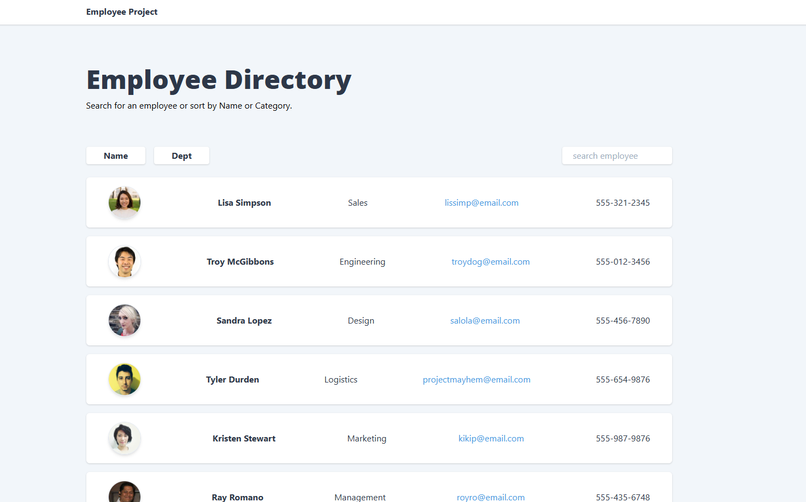

# How to Use This Terraform Code

1. Save as `main.tf`.
2. Create `variables.tf` with the variables defined.
3. Run `terraform init`, `terraform plan`, `terraform apply`.
4. The deployment automatically builds and the deploys the web app. One may choose to manually deploy after deployment if preferred:
- Build and deploy your React SPA and Node.js backend to the App Service (use `az webapp deploy` or CI/CD).
- In Node.js, use Managed Identity to connect to Cosmos: `const credential = new DefaultAzureCredential(); const client = new CosmosClient({ endpoint, credential });`.
- Seed data in Cosmos (e.g., employees collection with name/department fields).
- Access the app at `https://<app_service_name>.azurewebsites.net`.

This uses private endpoint for Cosmos, Managed Identity for auth, and a simple VNet setup. For production, add WAF, monitoring, and scale. Let me know if you need the React/Node code or refinements!

